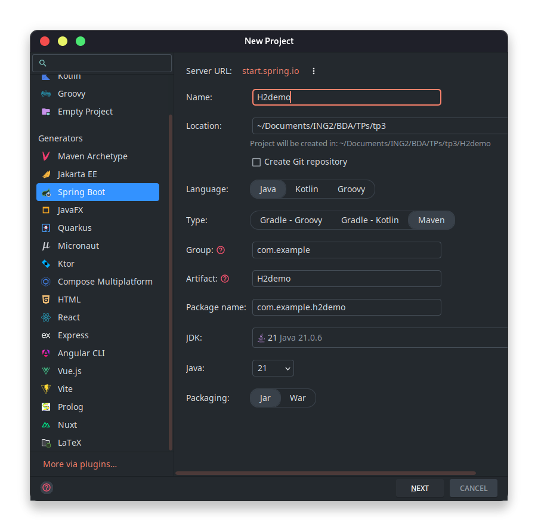

# Spring Boot TP3
## Etape 1
Créer et configurer un projet SpringBoot sur IntelliJ IDEA.


## Etape 2
On créer une nouvelle classe qui nous servira d'API (un controller).
Ici notre classe se nomme 'MyApi' et est située dans 'src/main/java/com/example/spring1/'
Voici le code de la classe qui nous permet de tester notre API :
```java
@RestController
public class MyApi
{
    @GetMapping(value="/bonjour")
    public String bonjour()
    {
        return "Bonjour";
    }

    @GetMapping(value="/bonsoir")
    public String bonsoir()
    {
        return "Bonsoir";
    }
}
```
Maintenant lorsqu'on se connecte via le navigateur à l'adresse suivante http://localhost:8080/bonjour on voit le message "Bonjour" s'afficher.

De même pour l'adresse http://localhost:8080/bonsoir qui affiche "Bonsoir".


Dans le fichier 'src/main/resources/application.properties' on peut configurer notre application. Par exemple, on peut changer le port par défaut (8080) en ajoutant la ligne suivante :
```properties
server.port=9999
```
Maintenant le serveur écoute sur le port 9999. On peut le vérifier en se rendant à l'adresse http://localhost:9999/bonjour qui affiche toujours "Bonjour".

## Etape 3
On crée une nouvelle classe 'Etudiant' qui nous servira de modèle pour notre API.
```java
public class Etudiant
{
    private int identifiant;
    private String nom;
    private double moyenne;

    public Etudiant()
    {
    }

    public Etudiant(int identifiant, String nom, double moyenne)
    {
        this.identifiant = identifiant;
        this.nom = nom;
        this.moyenne = moyenne;
    }

    public int getIdentifiant()
    {
        return identifiant;
    }

    public void setIdentifiant(int identifiant)
    {
        this.identifiant = identifiant;
    }

    public String getNom()
    {
        return nom;
    }

    public void setNom(String nom)
    {
        this.nom = nom;
    }

    public double getMoyenne()
    {
        return moyenne;
    }

    public void setMoyenne(double moyenne)
    {
        this.moyenne = moyenne;
    }
}
```
Et on peut l'ajouter a notre API 'MyApi' pour créer une nouvelle méthode qui renvoie un objet de type 'Etudiant'.
```java
@GetMapping(value="/etudiant")
public Etudiant getEtudiant()
{
    return new Etudiant(1, "A", 19);
}
```
Maintenant si on se rend à l'adresse http://localhost:9999/etudiant on voit s'afficher un objet de type 'Etudiant' au format JSON.


## Etape 4
On va maintenant faire une fonction avec paramètres.
```java
@GetMapping(value="/somme")
public double somme(double a, double b)
{
    return a + b;
}
```
Maintenant si on se rend à l'adresse http://localhost:9999/somme?a=1&b=2 on voit s'afficher le résultat de la somme de a et b.


## Etape 5
On va simuler une base de données en créant une liste d'étudiants.

```java
public static ArrayList<Etudiant> liste = new ArrayList<>();

static {
    liste.add(new Etudiant(0, "A", 19));
    liste.add(new Etudiant(1, "B", 20));
    liste.add(new Etudiant(2, "C", 13));
    liste.add(new Etudiant(3, "D", 16));
}
```
On va maintenant créer une méthode qui renvoie la liste d'étudiants.
```java
@GetMapping(value="/liste")
public Collection<Etudiant> getAllEtudiants()
{
    return liste;
}
```

Maintenant si on se rend à l'adresse http://localhost:9999/liste, on voit s'afficher la liste d'étudiants au format JSON.


## Etape 6
On peut créer une méthode qui renvoie un étudiant en fonction de son identifiant.
```java
@GetMapping(value="/getEtudiant")
public Etudiant getEtudiant(int identifiant)
{
    return liste.get(identifiant);
}
```
Maintenant si on se rend à l'adresse http://localhost:9999/getEtudiant?identifiant=0, on voit s'afficher l'étudiant avec l'identifiant 0.


## Etape 7
On va maintenant créer une méthode qui permet d'ajouter un étudiant à la liste.
```java
@PostMapping(value="/addEtudiant")
public Etudiant addEtudiant(Etudiant etudiant)
{
    liste.add(etudiant);
    return etudiant;
}
```

En utilisant l'outil HTTP Requester d'IntelliJ IDEA, on peut envoyer une requête POST à l'adresse http://localhost:9999/addEtudiant et on obtient la réponse suivante :
```bash
POST http://localhost:9999/addEtudiant?identifiant=5&nom=F&moyenne=12.5

HTTP/1.1 200 
Content-Type: application/json
Transfer-Encoding: chunked
Date: Tue, 29 Apr 2025 14:43:33 GMT

{
  "identifiant": 5,
  "nom": "F",
  "moyenne": 12.5
}
Response file saved.
> 2025-04-29T164333.200.json

Response code: 200; Time: 5ms (5 ms); Content length: 42 bytes (42 B)
```

L'étudiant a bien été ajouté à la liste. Si on se rend à l'adresse http://localhost:9999/liste, on voit s'afficher la liste d'étudiants avec le nouvel étudiant ajouté.


## Etape 8
De la même manière on peut créer une méthode qui permet de supprimer un étudiant de la liste.
```java
@DeleteMapping(value="/delete")
public void deleteEtudiant(int identifiant)
{
    liste.remove(identifiant);
}
```
En utilisant l'outil HTTP Requester d'IntelliJ IDEA, on peut envoyer une requête DELETE à l'adresse http://localhost:9999/delete?identifiant=3 et on obtient la réponse suivante :
```bash
DELETE http://localhost:9999/delete?identifiant=3

HTTP/1.1 200 
Content-Length: 0
Date: Tue, 29 Apr 2025 14:53:42 GMT

<Response body is empty>

Response code: 200; Time: 5ms (5 ms); Content length: 0 bytes (0 B)
```

L'étudiant a bien été supprimé de la liste. Si on se rend à l'adresse http://localhost:9999/liste, on voit s'afficher la liste d'étudiants sans l'étudiant supprimé.


Pareil pour la méthode qui permet de modifier un étudiant de la liste.
```java
@PutMapping(value="/modifier")
public void editEtudiant(int identifiant, String nom)
{
    liste.get(identifiant).setNom(nom);
}
```
En utilisant l'outil HTTP Requester d'IntelliJ IDEA, on peut envoyer une requête PUT à l'adresse http://localhost:9999/modifier?identifiant=2&nom=MODIF et on obtient la réponse suivante :
```bash
PUT http://localhost:9999/modifier?identifiant=2&nom=MODIF

HTTP/1.1 200 
Content-Length: 0
Date: Tue, 29 Apr 2025 14:57:44 GMT

<Response body is empty>

Response code: 200; Time: 59ms (59 ms); Content length: 0 bytes (0 B)
```

L'étudiant a bien été modifié dans la liste. Si on se rend à l'adresse http://localhost:9999/liste, on voit s'afficher la liste d'étudiants avec l'étudiant modifié.


# H2 TP3
## Etape 1
On crée un nouveau projet SpringBoot sur IntelliJ IDEA.

On choisit les dépendances suivantes :
- Spring Web
- Spring Data JPA
- H2 Database


## Etape 2
On cree trois nouveaux packages :
- com.example.h2demo.entities
- com.example.h2demo.repository
- com.example.h2demo.web

Dans entities, on crée une nouvelle classe 'Adherent' qui nous servira de modèle pour notre API.
```java
@Entity
public class Adherent
{
    @Id
    @GeneratedValue(strategy = GenerationType.AUTO)
    private Long id;
    private String nom;
    private String ville;
    private int age;

    public Adherent()
    {
    }

    public Adherent(Long id, String nom, String ville, int age)
    {
        this.id = id;
        this.nom = nom;
        this.ville = ville;
        this.age = age;
    }

    public Long getId() {
        return id;
    }

    public void setId(Long id) {
        this.id = id;
    }

    public String getNom() {
        return nom;
    }

    public void setNom(String nom) {
        this.nom = nom;
    }

    public String getVille() {
        return ville;
    }

    public void setVille(String ville) {
        this.ville = ville;
    }

    public int getAge() {
        return age;
    }

    public void setAge(int age) {
        this.age = age;
    }
}
```
Les annotations @Entity, @Id et @GeneratedValue sont des annotations de JPA qui permettent de définir une entité persistante.
L'annotation @Entity indique que la classe est une entité JPA, l'annotation @Id indique que le champ id est la clé primaire de l'entité et l'annotation @GeneratedValue indique que la valeur de la clé primaire sera générée automatiquement.
On crée ensuite une interface 'AdherentRepository' qui étend l'interface 'JpaRepository'.
```java
public interface AdherentRepository extends JpaRepository<Adherent, Long>
{
}
```
Cette interface nous permet d'accéder aux méthodes de la classe JpaRepository qui nous permet de faire des opérations CRUD sur notre entité Adherent.

## Etape 3
On ajoute un 'CommandLineRunner' dans la classe principale 'H2demoApplication' qui nous permettra de remplir la base de données avec des données de test.
```java
@Bean
CommandLineRunner runner(AdherentRepository repository)
{
    return args ->
    {
        repository.save(new Adherent(null, "A", "A", 30));
        repository.save(new Adherent(null, "B", "B", 25));
        repository.save(new Adherent(null, "C", "C", 35));
        repository.save(new Adherent(null, "D", "D", 40));
    };
}
```
Dans le fichier 'application.properties' on configurer notre application de cette manière.
```properties
spring.application.name=H2demo
server.port=9191
spring.datasource.url=jdbc:h2:mem:adherent
spring.h2.console.enabled=true
```

On peut maintenant lancer notre application et se rendre à l'adresse http://localhost:9191/h2-console pour accéder à la console H2.
Une fois la page chargée, on peut tester des requêtes SQL sur la base de données. Par exemple la requête suivante :
```sql
SELECT * FROM ADHERENT;
```

