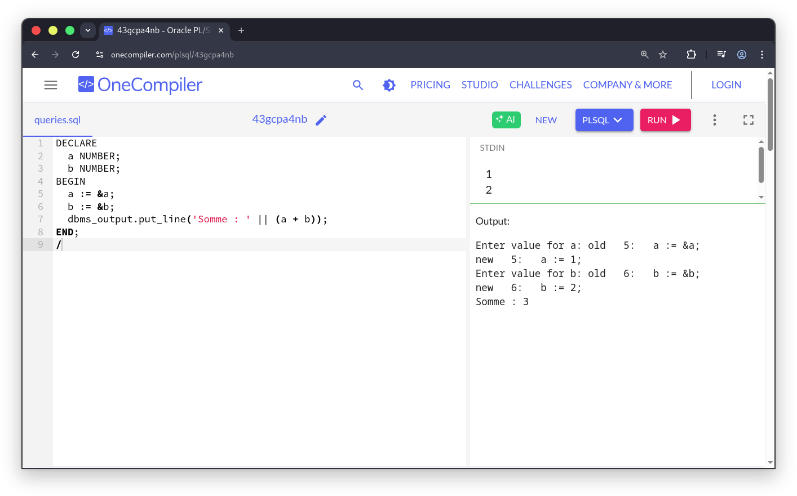
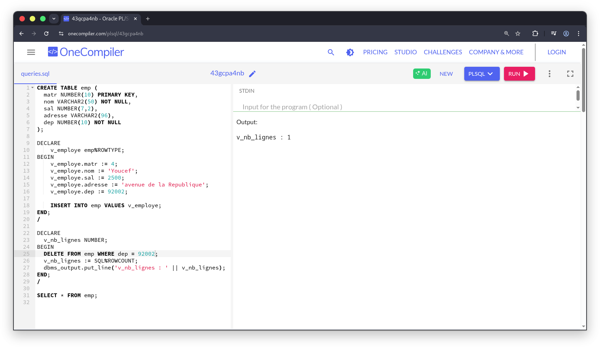
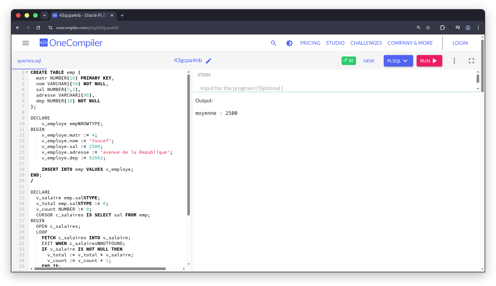

# Exercice 1
Pour l'ensemble de l'exercice, j'ai utilisé un éditeur/exécuteur de requêtes SQL en ligne
(https://onecompiler.com/plsql) pour tester les scripts.
## 1.1 
Écrire une procédure anonyme PL/SQL qui permet de demander à un utilisateur
de saisir deux entiers et d’afficher leur somme.
```sql
DECLARE
  a NUMBER;
  b NUMBER;
BEGIN
  a := &a;
  b := &b;
  dbms_output.put_line('Somme : ' || (a + b));
END;
/
```

Sortie :


## 1.2
Écrire une procédure anonyme PL/SQL qui permet de demander à un utilisateur
de saisir un nombre et d’afficher sa table de multiplication.
```sql
DECLARE
  n NUMBER;
  i NUMBER := 1;
BEGIN
  n := &n;
  WHILE i <= 10 LOOP
    dbms_output.put_line(n || ' x ' || i || ' = ' || (n*i));
    i := i + 1;
  END LOOP;
END;
/
```
Sortie :


## 1.3
Écrire une fonction récursive qui permet de retourner $x^{n}$, $x$ et $n$ sont deux entiers
positifs.
```sql
CREATE OR REPLACE FUNCTION puiss(x NUMBER, n NUMBER) RETURN NUMBER IS
BEGIN
  IF n = 0 THEN
    RETURN 1;
ELSE
    RETURN x * puiss(x, n-1);
END IF;
END;
/

SELECT puiss(2, 4) FROM dual;
```
Sortie avec l'appel de la fonction :
```sql
SELECT puiss(2, 4) FROM dual;
```
       

## 1.4  
Écrire une procédure anonyme PL/SQL qui calcule la factorielle d’un nombre
strictement positif saisi par l’utilisateur. Le résultat sera stocké dans une table
resultatFactoriel.

```sql
CREATE TABLE resultatFactoriel (n NUMBER PRIMARY KEY, fact NUMBER);

DECLARE
  n NUMBER;
  fact NUMBER := 1;
  i NUMBER;
BEGIN
  n := &n;
  IF n > 0 THEN
    fact := 1;
    FOR i IN 1..n LOOP
      fact := fact * i;
    END LOOP;
    INSERT INTO resultatFactoriel VALUES (n, fact);
    dbms_output.put_line('Factorielle de ' || n || ' = ' || fact);
  ELSE
    dbms_output.put_line('n doit être strictement positif');
  END IF;
END;
/
SELECT * FROM resultatFactoriel;
```

Sortie :


## 1.5
Modifier le programme précédent pour qu’il calcule et stocke dans une table resultatsFactoriels les factorielles des 20 premiers nombres entiers.
```sql
CREATE TABLE resultatFactoriel (n NUMBER PRIMARY KEY, fact NUMBER);

DELETE FROM resultatFactoriel;
DECLARE
  fact NUMBER := 1;
  i NUMBER;
BEGIN
  FOR n IN 1..20 LOOP
    fact := 1;
    FOR i IN 1..n LOOP
      fact := fact * i;
    END LOOP;
    INSERT INTO resultatFactoriel VALUES (n, fact);
  END LOOP;
END;
/

SELECT * FROM resultatFactoriel;
```
Sortie :


# Exercice 2
## 2.1
Écrire un bloc anonyme qui permet d’insérer un nouveau employé, dont les valeurs
des attributs matr, nom, sal, adresse et dep sont respectivement 4, Youcef, 2500,
avenue de la République, 92002.

```sql
DECLARE
    v_employe employe%ROWTYPE;
BEGIN
    v_employe.matr := 4;
    v_employe.nom := 'Youcef';
    v_employe.sal := 2500;
    v_employe.adresse := 'avenue de la République';
    v_employe.dep := 92002;

    INSERT INTO employe VALUES (v_employe);
END;
/
```

Sortie :


## 2.2
Écrire un bloc anonyme qui permet de supprimer tous les clients dont le dep est
connu, et utiliser la fonction ROWCOUNT pour afficher le nombre de n-uplets
supprimés.

```sql
DECLARE
  v_nb_lignes NUMBER;
BEGIN
  DELETE FROM emp WHERE dep = 10;
  v_nb_lignes := SQL%ROWCOUNT;
  dbms_output.put_line('v_nb_lignes : ' || v_nb_lignes);
END;
/

SELECT * FROM emp;
```

Sortie :


## 2.3
Écrire un bloc anonyme qui permet d’afficher la somme des salaires de tous les
employés, en utilisant un curseur explicite et la boucle LOOP AND LOOP. Cette
procédure doit vous afficher le même résultat que la requête suivante :
```sql
DECLARE
  v_salaire emp.sal%TYPE;
  v_total emp.sal%TYPE := 0;
  CURSOR c_salaires IS SELECT sal FROM emp;
BEGIN
  OPEN c_salaires;
  LOOP
    FETCH c_salaires INTO v_salaire;
    EXIT WHEN c_salaires%NOTFOUND;
    IF v_salaire IS NOT NULL THEN
      v_total := v_total + v_salaire;
    END IF;
  END LOOP;
  CLOSE c_salaires;
  dbms_output.put_line('total : ' || v_total);
END;
/
```

Sortie :


## 2.4
Modifier la procédure précédente pour calculer le salaire moyen.

```sql
DECLARE
  v_salaire emp.sal%TYPE;
  v_total emp.sal%TYPE := 0;
  v_count NUMBER := 0;
  CURSOR c_salaires IS SELECT sal FROM emp;
BEGIN
  OPEN c_salaires;
  LOOP
    FETCH c_salaires INTO v_salaire;
    EXIT WHEN c_salaires%NOTFOUND;
    IF v_salaire IS NOT NULL THEN
      v_total := v_total + v_salaire;
      v_count := v_count + 1;
    END IF;
  END LOOP;
  CLOSE c_salaires;
  IF v_count > 0 THEN
    dbms_output.put_line('moyenne : ' || (v_total / v_count));
  ELSE
    dbms_output.put_line('Aucun salaire trouvé');
  END IF;
END;
/
```

Sortie :


## 2.5
Modifier la procédure précédente en utilisant la boucle FOR IN.
```sql
DECLARE
  v_total emp.sal%TYPE := 0;
  v_count NUMBER := 0;
BEGIN
  FOR rec IN (SELECT sal FROM emp) LOOP
    IF rec.sal IS NOT NULL THEN
      v_total := v_total + rec.sal;
      v_count := v_count + 1;
    END IF;
  END LOOP;
  dbms_output.put_line('total : ' || v_total);
  IF v_count > 0 THEN
    dbms_output.put_line('moyenne : ' || (v_total / v_count));
  END IF;
END;
/
```
Sortie :


## 2.6
Écrire une procédure anonyme qui permet d’afficher les noms des employés du
département 92002 et 75000, en utilisant un curseur paramétré.
```sql
DECLARE
  CURSOR c(p_dep emp.dep%TYPE) IS
    SELECT nom FROM emp WHERE dep = p_dep;
BEGIN
  dbms_output.put_line('Departement 92000 :');
  FOR v_employe IN c(92002) LOOP
    dbms_output.put_line(v_employe.nom);
  END LOOP;
  dbms_output.put_line('Departement 75000 :');
  FOR v_employe IN c(75000) LOOP
    dbms_output.put_line(v_employe.nom);
  END LOOP;
END;
/
```

Sortie :


# Exercice 3
```sql
CREATE OR REPLACE PACKAGE gestion_clients AS
  PROCEDURE ajouter_client(nom VARCHAR2);
  PROCEDURE ajouter_client(nom VARCHAR2, adresse VARCHAR2);
END gestion_clients;
/

CREATE OR REPLACE PACKAGE BODY gestion_clients AS
  PROCEDURE ajouter_client(nom VARCHAR2) IS
  BEGIN
    INSERT INTO client(nom) VALUES (nom);
  EXCEPTION
    WHEN OTHERS THEN
      dbms_output.put_line('Erreur ajout client : ' || SQLERRM);
  END;
  PROCEDURE ajouter_client(nom VARCHAR2, adresse VARCHAR2) IS
  BEGIN
    INSERT INTO client(nom, adresse) VALUES (nom, adresse);
  EXCEPTION
    WHEN OTHERS THEN
      dbms_output.put_line('Erreur ajout client : ' || SQLERRM);
  END;
END gestion_clients;
/
```

Sortie :

